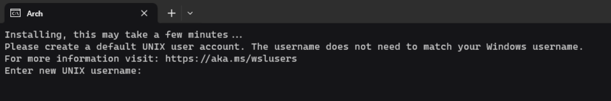
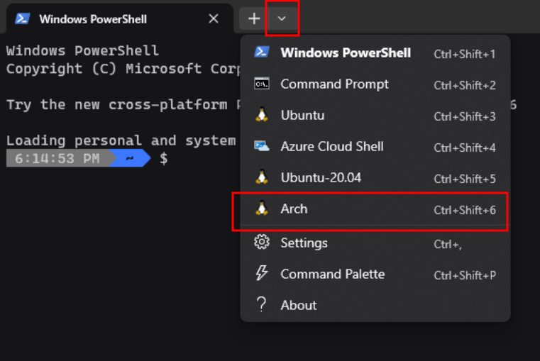
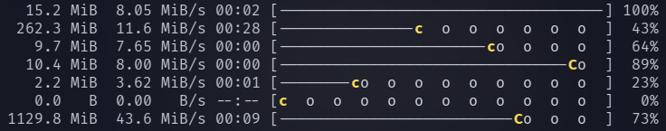

# Setting Up a Development Environment based on Arch in WSL

## WSL

WSL stand for Windows Subsystem for Linux and is a very handy tool for getting a development environment that is useful and translatable across platforms.  Development tools in linux are quite ergonomic and evolved, but there is some differences in concepts and conventions when compared to Windows.  We'll start with getting WSL running with a popular version of linux.  Linux has as many target audiences as there are nerds with opinions because of how configurable and open it is, so in the future you may prefer another version, but for now we're going to choose one that has the most up to date tools, and is very simple to customize: Arch.

To get WSL installed first, we run these commands in our terminal. See [the official docs](https://learn.microsoft.com/en-us/windows/wsl/install) for more information.

```console
wsl --install
wsl --set-default-version 2
```

## Arch

To get going with Arch in WSL, we visit the Windows Store.  Arch is easy to find by searching.


After installation is complete click 'open' in the store page for Arch.


This will open a terminal process to finalize the installation.



The username and password that you choose is arbitrary to Arch (it does not need to match any account or profile you have elsewhere on your system).  I recommend choosing a typable and easy to remember password because you will type it often to perform maintenance and administrative tasks while using linux.

After this is done, close the terminal and reopen.  You will be able to find and select Arch in the titlebar dropdown.



## Package Mirrors

Once within, you're first order of business should be to get your package mirrors configured.  Hopefully, the in-built mirrors work right away, but they will occasionally have issues, which we're going to mitigate now.  First try the command:

```bash
sudo pacman -Syy reflector
```

This is requesting the installation of a new package, a helper utility called `reflector`.  Because this is an administrative action, you will be prompted for your profile password (the one you set in the previous step).  This command consists of several segments.

* `sudo` - requests administrator privilege (this is what prompts you for your password)
* `pacman` - the name of the default utility for managing packages
* `-Syy` - the command to perform (S = sync, yy = update package databases).  Sync in this context means 'download and install it' and updating the package databases is necessary requirement to have information on versions and security checks about all the available packages.
* `reflector` - the name of the package we want to act on

Now let's update those mirror lists based on the most recent performance metrics

```bash
sudo reflector -f 30 -l 30 --number 10 --verbose --save /etc/pacman.d/mirrorlist
```

Similar to above, we're performing an administrative action because we're writing to a file that is normally protected `/etc/pacman.d/mirrorlist` which contains the list of mirrors our package manager relies on to download things.  The rest of the arguments above are requesting the list of mirrors as sorted by fastest `-f`, then latest `-l`, taking the top 10 `--number`, and overwriting our main mirrorlist file with the result.

We can check the contents of our mirrorfile to see if this worked.

```console
$ cat /etc/pacman.d/mirrorlist
################################################################################
################# Arch Linux mirrorlist generated by Reflector #################
################################################################################

# With:       reflector -f 30 -l 30 --number 10 --verbose --save /etc/pacman.d/mirrorlist
# When:       2023-12-06 17:19:08 UTC
# From:       https://archlinux.org/mirrors/status/json/
# Retrieved:  2023-12-06 17:17:44 UTC
# Last Check: 2023-12-06 16:52:27 UTC

Server = http://arlm.tyzoid.com/$repo/os/$arch
Server = http://arch.mirror.constant.com/$repo/os/$arch
Server = https://arch.mirror.constant.com/$repo/os/$arch
Server = https://mirror.lty.me/archlinux/$repo/os/$arch
Server = http://mirror.lty.me/archlinux/$repo/os/$arch
Server = http://packages.oth-regensburg.de/archlinux/$repo/os/$arch
Server = http://archlinux.mailtunnel.eu/$repo/os/$arch
Server = http://mirror.f4st.host/archlinux/$repo/os/$arch
Server = http://arch.jensgutermuth.de/$repo/os/$arch
Server = http://mirror.telepoint.bg/archlinux/$repo/os/$arch
```

Note the command we used to update the mirrors is right there in the listing, so you can remind yourself in the future when you feel like installations are getting slow or flakey you can rerun this command.

## Pacman Config (sudoedit)

Let's modify some of the behaviors of our package manager and take the opportunity to learn about `sudoedit` for messing with system-protected configs.  `sudoedit` is the accepted safe way to edit files that require administrator permission to edit.  It works by creating a copy and working on that, only copying it back to its original place after you save and exit your editor normally.  The editor you use is up to you, and I prefer `micro` for getting started.  Let's grab that now.

```bash
sudo pacman -S micro
```

Once we have it, we'll immediately put it to use editing our environment so that `sudoedit` knows to use it.

```console
micro ~/.bashrc
```

This will open your profile script for editing.  This script runs when your shell is launched to configure the environment to your liking, making it one of the natural places to alter behavior like this.  Towards the end of the file add the line

```bash
export EDITOR=micro
```

Save with `Ctrl+S` and quit with `Ctrl+Q`.  Now we will source our change to get the updated configuration into the current environment.

```bash
source ~/.bashrc
```

Now we can update our pacman configuration

```console
sudoedit /etc/pacman.conf
```

Under the "Misc Options" enable "Color" disable "NoProgressBar" and "VerbosePkgLists" and add a special key "ILoveCandy"

```bash
# Misc options
#UseSyslog
Color
#NoProgressBar
# We cannot check disk space from within a chroot environment
#CheckSpace
#VerbosePkgLists
ILoveCandy
ParallelDownloads = 5
```

We're left with a much nicer looking output.



## Paru

I find working directly with `pacman` for system management to be tiresome.  So this is the utility that I use instead.  First make a directory for grabbing and building custom packages then we grab, build, and install.

```console
mkdir ~/pkgbuild
cd ~/pkgbuild
git clone https://aur.archlinux.org/paru-bin.git 
cd paru-bin
makepkg -i
```

Paru does some things for us automatically that are manual actions in pacman (such as checking for updated sources), and it interacts with the AUR by itself (the user-managed package system we just got paru from).  However it has one annoyance that should be corrected in the configuration, that is, when searching for packages by name, it will put the best match first (which immediately scrolls off the page if you got very many results).  To remedy this, it supports an inverted display that puts the best match last (right next to your cursor after the search) which is much more natural.

```console
sudoedit /etc/paru.conf
```

Find the line under `[options]` that says `#BottomUp` and remove the leading `#` character.  This causes the inverted search view option to be enabled.

## Starship

Starship is a shell homogenizer that makes it so that whether we're working in Windows using powershell, linux using powershell, bash, fish, or any other shell, we can have a consistent(ly nice) experience.

```bash
paru starship
```

After installed, nothing changes, because we must invoke starship from our shell.  As before, the conventional place to do that is within our `.bashrc` file.

```console
micro ~/.bashrc
```

Add the following line somewhere near the end of the file.

```bash
source <("/usr/bin/starship" init bash --print-full-init)
```
