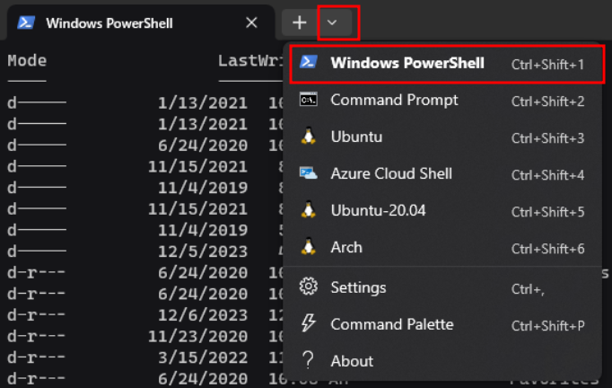

# Setting up Windows to be a Development Environment

Windows is easy to use casually, and it can be adapted to work well as a development environment.  But you need to perform some setup to get things comfortable for the longer-term.  This document contains some tips and utilities to make life easier.

## Software

### Windows Terminal

The Command Prompt `cmd` is likely familiar to anyone who has attempted anything even slightly complicated on windows.  It is a very old piece of software that was present in even the very earliest releases of windows.  There has been an attempt recently to upgrade this feature into one more modern, simple, and even pretty.  This new software is called "Windows Terminal" and can be obtained through the integrated store.


Afterward opening it should take you to powershell, but if it doesn't you can choose it with the dropdown in the titlebar.



You can alter what you wish the default flavor of shell you open is by visiting the "Settings" in the same dropdown menu.


While there explore the other settings and customize as you like.

### Scoop

Scoop is a package manager for windows that works from the command line, making it comfortable to quickly and simply obtain software that otherwise requires knowledge of where to download it, complex setup, or other issues that make software management on windows generally painful.  This is a common feature of Linux (another operating system) and has been adapted with that in mind to bring that convenience to windows.

To install and use it, you need powershell, so open Terminal from the previous step and type the following installation command.

```powershell
iwr -useb get.scoop.sh | iex
```

If you get an error about "permission" then its possible your account hasn't been granted the right to execute scripts like this.  You can enable that by typing this before trying the original command again.

```powershell
Set-ExecutionPolicy RemoteSigned -scope CurrentUser
```

Scoop has the concept of "buckets" that contain lists of software.  You can see these within the tool.

```console
$ scoop bucket known
main
extras
versions
nirsoft
sysinternals
php
nerd-fonts
nonportable
java
games
```

For our purposes let's make sure we have the "extras" bucket because it has some useful stuff in it.  

```console
scoop bucket add extras
```

### Visual Studio Code

"Code" is a simple and extensible modern development tool that has too many features to list, but starts out as a straightforward text editor.  Without knowing much you can use this tool to ramp up your familiarity with programming, development, and the lower level configuration of your system as you make it more and more useful to you over time.

Use scoop (the tool from the previous step) to install by typing in your terminal.

```console
scoop install vscode
```

After installation you'll see a message about running some extra commands for extra functionality.

```console
Notes
-----
Add Visual Studio Code as a context menu option by running:
'reg import "C:\Users\smurray\scoop\apps\vscode\current\install-context.reg"'
For file associations, run:
'reg import "C:\Users\smurray\scoop\apps\vscode\current\install-associations.reg"'
```

We'll go ahead and do that by copying the lines and removing the single-quotes

```powershell
$ reg import "C:\Users\smurray\scoop\apps\vscode\current\install-context.reg"
The operation completed successfully.
$ reg import "C:\Users\smurray\scoop\apps\vscode\current\install-associations.reg"
The operation completed successfully.
```

You can now launch Visual Studio Code from the start menu or within the terminal by typing `code`

### Git

Git is a source management tool that is nearly invaluable for tracking your own work and especially following what other people are doing and managing code coming from somewhere else.  It is complex and has many parts and options, but at the most basic level, it is just another tool for you to grow into that we'll want immediately in our arsenal.

```console
scoop install git
```

You'll get some notes at the end, but ignore those for now.  To see that it's working let's create a folder.

```console
$ mkdir test # make a directory
$ cd test    # enter that directory
$ git init   # create a git workspace
hint: is subject to change. To configure the initial branch name to use in all
hint: of your new repositories, which will suppress this warning, call:
hint:
hint:   git config --global init.defaultBranch <name>
hint:
hint: Names commonly chosen instead of 'master' are 'main', 'trunk' and
hint: 'development'. The just-created branch can be renamed via this command:
hint:
hint:   git branch -m <name>
Initialized empty Git repository in ~/test/.git/
```

Git warns us that it's created a starter "branch" for our code named "master" but we might be offended by that word, so the option exists to make a different branch name the default.  Let's soothe the poor tool by verifying that we weren't hurt, and in the future not to worry so much.

```console
git config --global init.defaultBranch master
```

## Customization

### Starship

Starship is a customization layer for shells (like powershell) that grant them many extra features in a way that works in most shells, meaning once you get your configuration how you like it, you can take it to another platform (wsl running "bash" or "fish") easily.

In powershell, we use scoop to install.

```console
scoop install starship
```

Afterward we're shown a note.

```console
Notes
-----
Usage: Add 'Invoke-Expression (&starship init powershell)' to the end of your PowerShell $PROFILE.
Prerequisites: A Powerline font installed and enabled in your terminal.
```

In powershell, we get things to run automatically by putting commands into our profile script, which is linked handily by a shell variabled named `$PROFILE`.  Relying on vscode we installed earlier, we'll use that to edit our profile script and add the requested line to activate starship.

```powershell
code -r $PROFILE
```

Code when invoked with the `-r` argument opens any copy of code that is already running and adds whatever you mentioned to the context.  You can use this to avoid spawning instances of code all over your desktop and losing track of what's going on.

After adding the line to the end of our profile script as directed, back in powershell we will "source" it.  This is either done by closing the terminal and reopening to get it to run again, or by just directly running it again like so.

```powershell
. $PROFILE
```

Our prompt should have changed, and if we go into the directory we made before for testing `git` we'll see something new.


### Nerd-font

There are a group of symbols added to some fonts specifically for programmers called collectively 'powerline' or 'nerd-font' symbols.  You can get fonts with these symbols patched in from an included scoop bucket.  We'll add one font immediately for demonstration.

```console
scoop add bucket nerd-fonts
scoop install CascadiaCode-NF
```

Afterward you can adjust the font settings for Terminal by editing the `Settings > Defaults > Font face` setting


And we now see in our terminal the square has been replaced by a "git branch" symbol.


You can see a sample listing of these fonts and pick one for yourself at <https://www.nerdfonts.com>.
